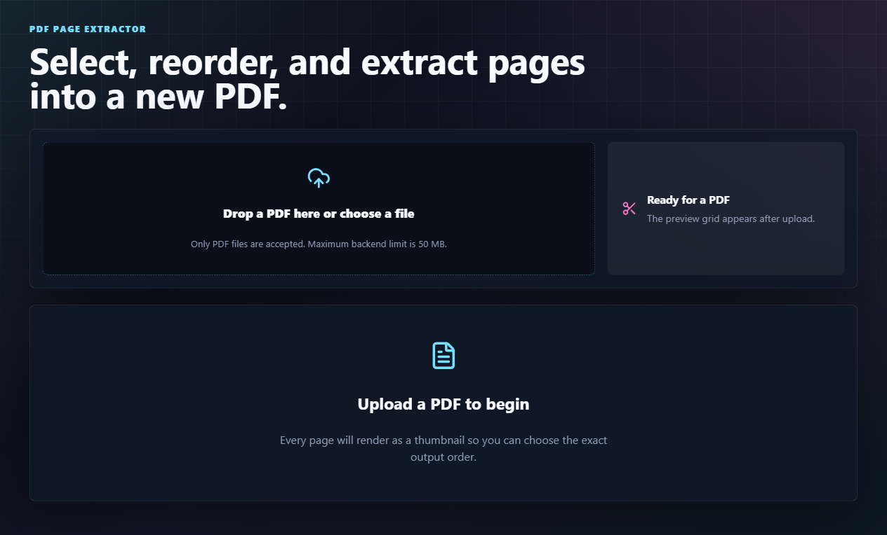

# PDF Page Extractor

A full-stack PDF manipulation app with authentication. Users sign up, verify email OTP, log in with JWT, upload PDFs, preview pages, select/reorder pages, and download a newly generated PDF.

## Tech Stack

- Frontend: React, Vite, TypeScript, Vanilla CSS, Framer Motion, PDF.js, Lucide React
- Backend: Node.js, Express, TypeScript, ES Modules, Multer, PDF-lib, Node Cron
- Auth: JWT, bcrypt password hashing, OTP email verification with Nodemailer
- Storage: Local file system plus JSON records for users and PDF ownership, with optional MongoDB/Mongoose setup and models
- Tests: Node built-in test runner for backend PDF extraction logic

## Architecture

The backend follows a clean layered flow:

- `routes`: maps REST endpoints to controller functions.
- `controllers`: validates HTTP input and shapes HTTP responses.
- `contracts`: defines repository, service, validator, and mapper abstractions.
- `config/dependencies.ts`: central DI composition root that wires concrete classes to abstractions.
- `services`: contains auth, email, and PDF business logic.
- `constants`: keeps route paths, status codes, messages, storage names, and limits in one place.
- `repositories`: implements repository contracts for user and PDF persistence.
- `middleware`: verifies JWT tokens before protected routes.
- `config`: keeps upload/storage middleware setup.
- `utils`: contains background cleanup jobs.

Auth flow:

- User signs up with name, email, and password.
- Backend hashes the password with bcrypt.
- Backend generates a 6-digit OTP, hashes it, stores expiry/attempt data, and sends it by email.
- User verifies OTP.
- Backend marks account verified and returns a JWT token.
- If a user forgets their password, backend sends a password reset OTP.
- User submits email, reset OTP, and new password.
- Frontend stores the token in `localStorage`.
- Protected PDF APIs require `Authorization: Bearer <token>`.
- Uploaded PDFs are saved with the logged-in user's `userId`.

## Setup

Open two terminals.

Backend:

```bash
cd backend
npm install
copy .env.example .env
npm run dev
```

Frontend:

```bash
cd frontend
npm install
copy .env.example .env
npm run dev
```

Default URLs:

- Frontend: `http://localhost:5173`
- Backend: `http://localhost:5000`

Production-style backend run:

```bash
cd backend
npm run build
npm start
```

## Environment Variables

Backend `.env.example`:

```env
PORT=5000
NODE_ENV=development
UPLOAD_DIR=uploads
OUTPUT_DIR=outputs
CLEANUP_INTERVAL_MINUTES=60
JWT_SECRET=replace-with-a-long-random-secret
JWT_EXPIRES_IN=7d
MONGODB_URI=
MONGODB_DB_NAME=pdf_extractor
SMTP_HOST=
SMTP_PORT=587
SMTP_USER=
SMTP_PASS=
SMTP_FROM=
```

If SMTP values are empty in development, the backend logs the OTP to the console and returns `devOtp` in the signup/resend response. In production, configure SMTP and never expose OTPs in responses.

Frontend `.env.example`:

```env
VITE_API_URL=http://localhost:5000
```

## API Endpoints

### Auth

`POST /api/auth/signup`

- Body: `{ "name": "User", "email": "user@example.com", "password": "password123" }`
- Creates an unverified user and sends OTP.

`POST /api/auth/verify-otp`

- Body: `{ "email": "user@example.com", "otp": "123456" }`
- Verifies account and returns JWT token.

`POST /api/auth/resend-otp`

- Body: `{ "email": "user@example.com" }`
- Sends a new OTP after cooldown.

`POST /api/auth/login`

- Body: `{ "email": "user@example.com", "password": "password123" }`
- Returns JWT token for verified users.

`POST /api/auth/forgot-password`

- Body: `{ "email": "user@example.com" }`
- Sends a password reset OTP.

`POST /api/auth/reset-password`

- Body: `{ "email": "user@example.com", "otp": "123456", "password": "newpassword123" }`
- Resets the password after OTP validation.

`GET /api/auth/me`

- Header: `Authorization: Bearer <token>`
- Returns current user.

### PDFs

`POST /api/pdfs/upload`

- Header: `Authorization: Bearer <token>`
- Form field: `pdf`
- Accepts only PDF files
- Returns PDF id, original name, size, page count, and preview URL

`GET /api/pdfs/:id`

- Header: `Authorization: Bearer <token>`
- Serves the uploaded PDF inline for frontend preview rendering

`POST /api/pdfs/:id/extract`

- Header: `Authorization: Bearer <token>`
- JSON body: `{ "pages": [3, 1, 2] }`
- Page numbers are one-based and order matters
- Returns a generated PDF download URL

## Tests

```bash
cd backend
npm test
```

The tests verify that selected pages are extracted and invalid page ranges are rejected.

## Screenshots

Upload state:



## Deployment Notes

For a live version, deploy the backend to a Node host and the frontend to a static host. Set `JWT_SECRET`, SMTP values, and `VITE_API_URL` before building/deploying.
